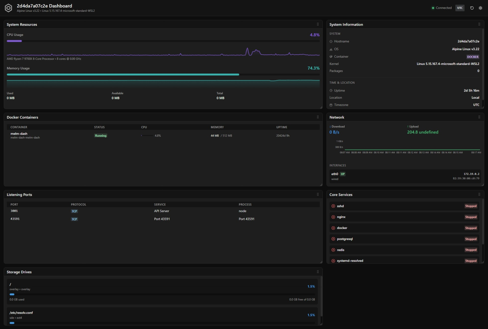

<div align="center">
  

---

  **Real-time Linux System Monitoring Dashboard**

  [](LICENSE)
  [](https://www.docker.com/)
  [](https://nodejs.org/)
  [](https://www.typescriptlang.org/)

  A modular drag-and-drop dashboard for monitoring CPU, memory, network, Docker containers, storage, systemd services, and open ports through a responsive web interface.

</div>

---

<div align="center">
  
</div>

## Features

- **Customizable Layout** - Drag-and-drop panels to personalize your dashboard
- **Real-time Metrics** - WebSocket updates every 2-10 seconds
- **Docker Integration** - Container status and resource usage
- **Service Monitoring** - Systemd services and open ports
- **Historical Data** - Time-series charts with configurable retention

## Quick Start (Docker)

**Requirements**: Docker, Docker Compose, Linux host

1. **Configure Docker socket access**
   Find your Docker group ID and update `docker-compose.yml`:
   ```bash
   getent group docker | cut -d: -f3  # Get GID
   # Update group_add in docker-compose.yml with this value
   ```

2. **Deploy**
   ```bash
   docker compose up -d
   ```

3. **Access**
   Dashboard: http://localhost:3001
   Health check: http://localhost:3001/health

## Development

### Native (without Docker)

**Requirements**: Node.js 18+, pnpm 8+, Linux

```bash
pnpm install    # Install dependencies
pnpm dev        # Start dev servers (backend + frontend)
```

Access: http://localhost:5173 (frontend) | http://localhost:3001 (backend)

**Commands**: `build`, `test`, `lint`, `typecheck`, `clean`

See [Native Development Guide](docs/NATIVE.md) for configuration, troubleshooting, and architecture details.

### Docker Development

```bash
pnpm dev:docker        # Start container with hot reload
pnpm dev:docker:down   # Stop container
```

Access: http://localhost:5173 (frontend) | http://localhost:3000 (backend)

See [Docker Development Guide](docs/DOCKER.md#development-with-docker) for details.

## Configuration

Configure via environment variables in `docker-compose.yml` or `.env`:

| Variable | Default | Description |
|----------|---------|-------------|
| `PORT` | `3001` | Server port |
| `LOG_LEVEL` | `info` | Logging level |
| `INTERVAL_CPU` | `2000` | CPU metrics interval (ms) |
| `INTERVAL_MEMORY` | `3000` | Memory metrics interval (ms) |
| `INTERVAL_NETWORK` | `2000` | Network metrics interval (ms) |
| `INTERVAL_DOCKER` | `5000` | Docker stats interval (ms) |
| `INTERVAL_STORAGE` | `30000` | Storage check interval (ms) |
| `INTERVAL_SERVICES` | `10000` | Service check interval (ms) |
| `INTERVAL_PORTS` | `10000` | Port scan interval (ms) |
| `HISTORY_MAX_POINTS` | `300` | Data points in memory |

## Architecture

- **Backend**: Fastify server with WebSocket support
- **Frontend**: React + Chakra UI + react-grid-layout
- **Metrics**: [systeminformation](https://www.npmjs.com/package/systeminformation) library
- **Build**: Multi-stage Docker build with pnpm workspace
- **Security**: Non-root user, helmet middleware, CORS, rate limiting

See documentation for detailed architecture and deployment guides.

## Documentation

- [Native Development Guide](docs/NATIVE.md) - Local development, configuration, troubleshooting
- [Docker Deployment Guide](docs/DOCKER.md) - Build, configure, and deploy with Docker

## License

MIT